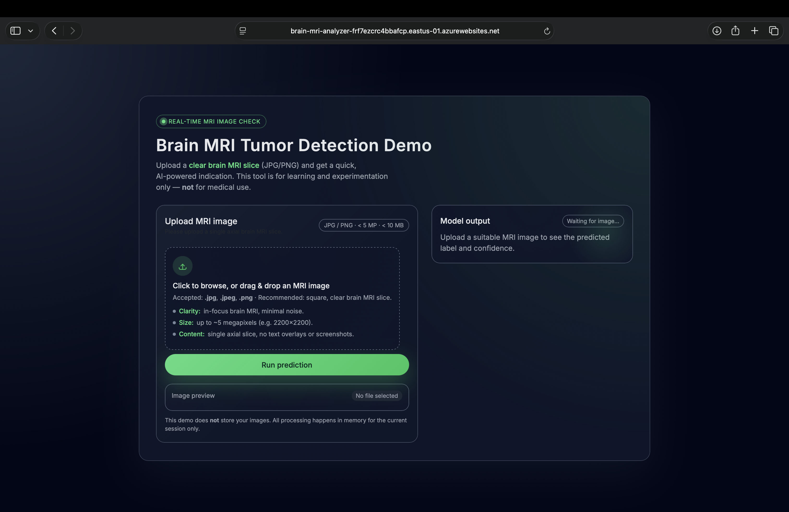

# Brain MRI Tumor Detector

A deep learning–powered web application for detecting brain tumors from MRI images. Users upload an MRI scan through a web interface, and the model predicts whether a **tumor** is present or not.

The application is containerized with Docker and deployed to **Azure App Service (Linux)** using an image stored in **Azure Container Registry (ACR)**.

---

## Author

**Aswin Anil Bindu**  
Applied AI Solutions – George Brown College  
GitHub: [Aswinab97](https://github.com/Aswinab97)

---

## Live Web App

The Brain MRI Tumor Detector is deployed and accessible at:

- **URL:** https://brain-mri-analyzer-frf7ezcrc4bbafcp.eastus-01.azurewebsites.net

> The first request may take a few seconds while the container starts (cold start).

---

## Web App Interface (Screenshot)

Screenshot of the web interface used to upload MRI images and view predictions:



---

## Project Overview

This is an end-to-end computer vision project that includes:

### 1. Data Preparation

- Organizing MRI images into tumor / non‑tumor classes.  
- Basic preprocessing (resize, normalization) for model input.  

### 2. Model Development

- Training and evaluation of deep learning models for binary classification:
  - `resnet18_brain_mri_mps.pth`
  - `simple_cnn_baseline_mps.pth`
- Metrics stored as JSON in the `reports/` directory.  

### 3. Inference API

- **FastAPI** application that:
  - Accepts uploaded MRI images.
  - Runs inference using the selected model.
  - Returns a prediction: **tumor** / **no tumor**.

### 4. Dockerization & Deployment

- Docker image defined via `Dockerfile`.  
- Deployed on **Azure App Service (Linux)**.  
- Container image hosted in **Azure Container Registry (ACR)**.  

---

## Data

This project uses a brain MRI dataset with labeled images indicating presence or absence of tumor.

- **Classes:**
  - `yes` → MRI scan with tumor.  
  - `no` → MRI scan without tumor.  

- **Local folder structure (not all committed to git):**

```text
data_raw/
├── yes/       # Tumor present
└── no/        # Tumor absent
```

Raw data and some large assets are not pushed to GitHub (see `.gitignore`).

---

## Model Overview

Two main PyTorch models are used:

- **ResNet18-based model**
  - Pretrained backbone, fine-tuned on brain MRI images.
  - Checkpoint: `models/resnet18_brain_mri_mps.pth`.

- **Simple CNN baseline**
  - Custom small CNN used for comparison.
  - Checkpoint: `models/simple_cnn_baseline_mps.pth`.

Evaluation results (accuracy, confusion matrix, etc.) are stored as JSON files in:

```text
reports/
├── resnet18_results.json
└── simple_cnn_results.json
```

---

## Inference Flow

1. **Upload**
   - User uploads a brain MRI image via the web UI or API.

2. **Preprocessing**
   - Image is resized and normalized to match training preprocessing.
   - Converted into a PyTorch tensor batch and moved to CPU / MPS.

3. **Prediction**
   - Model weights are loaded from `models/*.pth`.
   - A forward pass generates class probabilities.

4. **Output**
   - Highest probability class is mapped to:
     - `tumor`
     - `no tumor`
   - Result is displayed on the UI and can also be returned as JSON.

Core code:

- Inference utilities: `src/inference.py`.  
- API routes & web app: `src/api.py` (FastAPI).  

---

## Tech Stack

- **Language:** Python  
- **Deep Learning:** PyTorch  
- **Web Framework:** FastAPI (served with Uvicorn / Gunicorn)  
- **Containerization:** Docker  
- **Cloud:** Azure App Service (Linux), Azure Container Registry  
- **OS:** macOS / Linux compatible  

---

## Project Structure

```text
brain-mri-tumor-detector/
│
├── data_raw/                   # Raw MRI images (ignored in git)
│   ├── no/
│   └── yes/
├── data_processed/             # Processed data (ignored in git)
├── models/
│   ├── resnet18_brain_mri_mps.pth
│   └── simple_cnn_baseline_mps.pth
├── notebooks/
│   └── 00_explore_data.ipynb   # Data exploration / experiments
├── reports/
│   ├── resnet18_results.json
│   └── simple_cnn_results.json
├── src/
│   ├── __init__.py
│   ├── api.py                  # FastAPI app (web/API entry point)
│   └── inference.py            # Model loading & prediction logic
├── images/
│   └── app-screenshot.png      # Web UI screenshot
├── Dockerfile                  # Docker image definition
├── startup.sh                  # Startup script for Azure App Service
├── requirements.txt            # Python dependencies
└── README.md
```

---

## Local Setup and Usage

### 1. Clone the repository

```bash
git clone git@github.com:Aswinab97/brain-mri-tumor-detector.git
cd brain-mri-tumor-detector
```

(Or use HTTPS: `https://github.com/Aswinab97/brain-mri-tumor-detector.git`.)

### 2. Create and activate a virtual environment

```bash
python -m venv .venv
source .venv/bin/activate      # Windows: .venv\Scripts\activate
```

### 3. Install dependencies

```bash
pip install -r requirements.txt
```

### 4. Run the FastAPI app locally

```bash
uvicorn src.api:app --host 0.0.0.0 --port 8000
```

Then open:

- Web UI: `http://localhost:8000`  
- API docs (Swagger UI): `http://localhost:8000/docs`  

---

## Docker Usage

### Build the Docker image (local)

```bash
docker build -t brain-mri-app:latest .
```

For Azure (Linux/amd64):

```bash
docker buildx build \
  --platform linux/amd64 \
  -t brain-mri-app-amd64:latest \
  .
```

### Run the container

```bash
docker run -p 8000:8000 brain-mri-app:latest
```

Access the app at: `http://localhost:8000`.

---

## Azure Deployment (High-Level)

The app is deployed as a Docker container to **Azure App Service (Linux)** using **Azure Container Registry (ACR)**.

### 1. Build and push the image to ACR

```bash
# Example values – update for your environment
ACR_NAME=brainmriregaswin
IMAGE_NAME=brain-mri-app
TAG=amd64

az acr login --name $ACR_NAME

docker buildx build \
  --platform linux/amd64 \
  -t $ACR_NAME.azurecr.io/$IMAGE_NAME:$TAG \
  .

docker push $ACR_NAME.azurecr.io/$IMAGE_NAME:$TAG
```

### 2. Configure Azure Web App for Containers

In Azure Portal:

- Create a **Web App** (Linux).  
- Publish: **Docker Container**.  
- Image source: **Azure Container Registry**.  
- Use:
  - Registry: `$ACR_NAME`  
  - Image: `$IMAGE_NAME`  
  - Tag: `$TAG`  
- Set container port to `8000`.  

### 3. Startup command (if needed)

In **Configuration → General settings** or **Container settings**, you can set:

```bash
./startup.sh
```

or directly:

```bash
gunicorn -k uvicorn.workers.UvicornWorker -w 1 -b 0.0.0.0:8000 src.api:app
```

---

## Use Case

This project demonstrates how deep learning can support **medical image analysis**:

- Early indication of tumor presence from MRI scans.  
- Decision support for radiologists and clinicians.  
- Educational / research example of an end‑to‑end medical imaging pipeline.  

> **Disclaimer:** This model is not a medical diagnostic tool and must not be used for real clinical decisions without proper validation and regulatory approval.

---

## Limitations

- Dataset size and diversity may be limited compared to real hospital data.  
- Trained on a specific dataset; performance may not generalize without retraining.  
- No extensive hyperparameter tuning or cross‑validation pipeline yet.  

---

## Notebooks

Exploratory analysis and experimentation are available in:

```text
notebooks/00_explore_data.ipynb
```

Run:

```bash
jupyter notebook
```

Then open the notebook from the browser UI.

---

## Model performance

The app uses a fine‑tuned ResNet‑18 model trained on labeled brain MRI slices (binary classification: tumor vs. no tumor).

On a held‑out test set of 38 images, the current model achieves:

- **Test accuracy:** **76.3%**
- **Tumor (positive) class:**
  - Precision: **73.3%**
  - Recall (sensitivity): **95.7%**
  - F1 score: **83.0%**
- **No tumor (negative) class:**
  - Precision: **87.5%**
  - Recall: **46.7%**
  - F1 score: **60.9%**

These results come from the following test confusion matrix:

- True negatives: 7  
- False positives: 8  
- False negatives: 1  
- True positives: 22  

In other words, the model is tuned to be **sensitive to tumor cases** (it rarely misses a tumor) but can produce **false positives** (flagging some healthy scans as tumor).

> These metrics are specific to the dataset and test split used in this project.  
> This demo is for educational purposes only and must **not** be used for clinical decision‑making.

---

## Future Improvements

- Hyperparameter tuning for improved accuracy.  
- Grad‑CAM or attention maps for tumor region visualization.  
- Support for multiple tumor types or segmentation.  
- Unit tests and CI (GitHub Actions).  
- Enhanced logging, monitoring, and error handling in production.  

---

## License

This project is licensed under the **MIT License**.  
See the [LICENSE](LICENSE) file for details.
